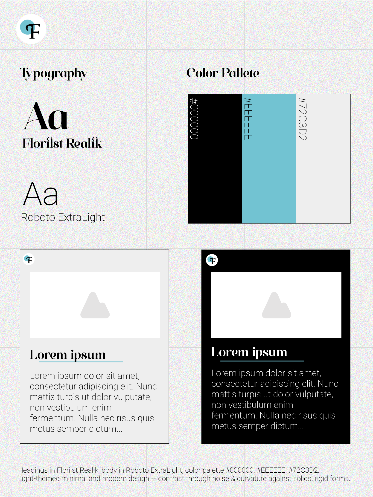

# Decide Once: Build Your Identity Kit

## General AI Fluency - Week 3

## Style Note

Headings in Florilst Realik, body in Roboto ExtraLight; color palette #000000, #EEEEEE, #72C3D2.


Light-themed minimal and modern design — contrast through noise & curvature against solid, rigid forms.

