# Kill your darlings: Curate Your Images

## General AI Fluency - Week 3

Every image below is mapped to a specific slot in the content map (Home → Proof of Work → Contact → About) except general images. Some images still need to be refined, but are fine for now.

## General

### Background Texture

| Rejected BG 1                                                                               | Rejected BG 2                                                                                            |
| ------------------------------------------------------------------------------------------- | -------------------------------------------------------------------------------------------------------- |
| 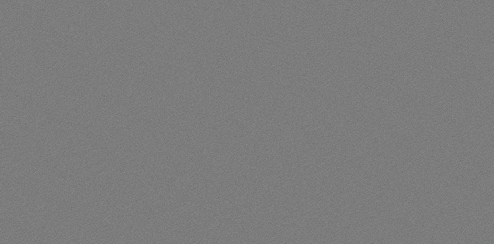                                                                      | 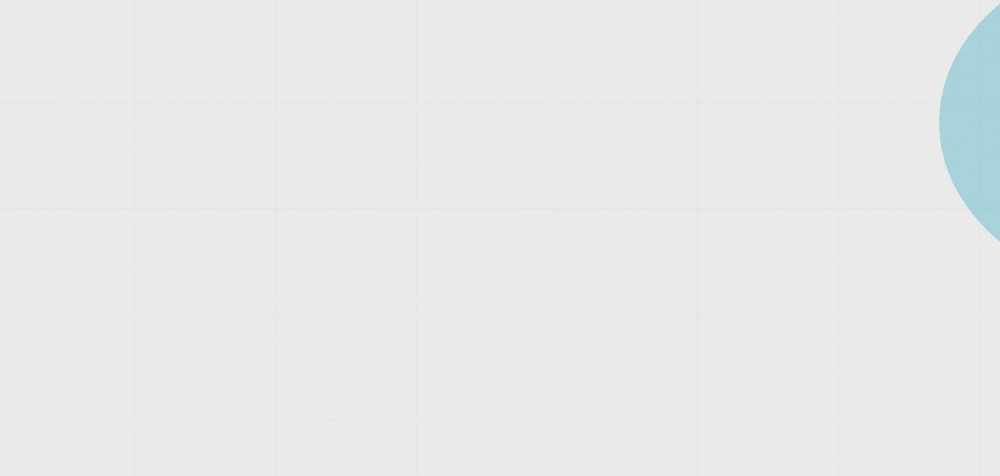                                                                             |
| I rejected this as it does not follow the light theme philosophy. Although I like the noise | This was rejected due to lack of noise even though it follows the light theme and uses the accent color. |

With the ideas from Claude, I just combined the noise and the light themed grid to create a satisfactory background.

| Final Background        |
| ----------------------- |
| 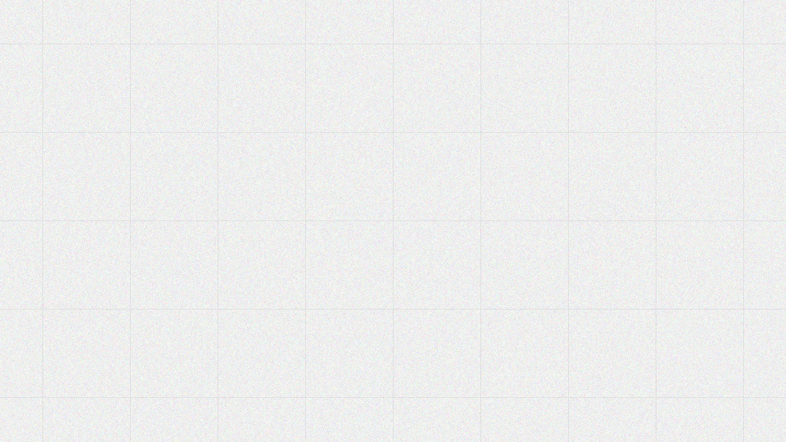 |

### Icons

| Generated Icons        |
| ---------------------- |
| 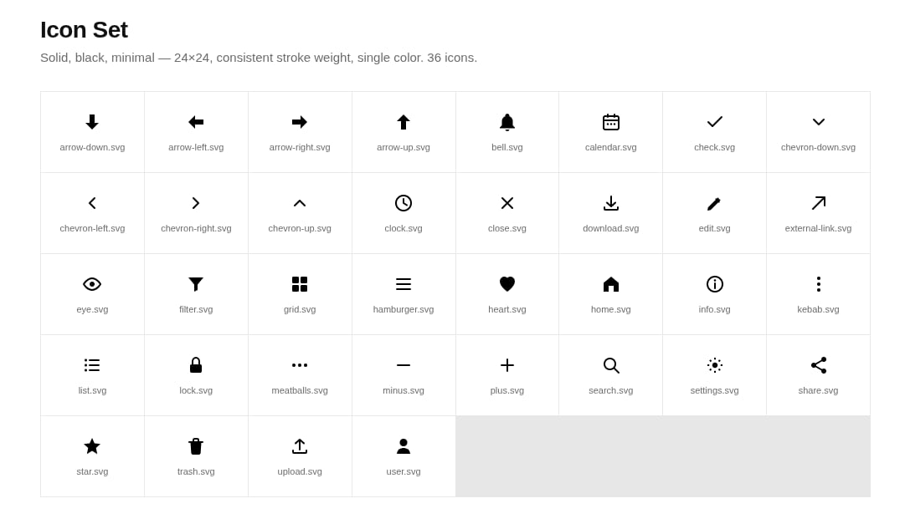 |

To make this, I added additional instructions to Claude. I stated that aside from following the design-kit, the icons should follow a solid, black, style which it did. I actually dig this one as it follows the design-kit philosophy really well.

---

## Home

### Cannot be generated

These cannot be generated as it represents me and the actual view of my work.

| My Photo                | Lead Case Snapshot        |
| ----------------------- | ------------------------- |
| 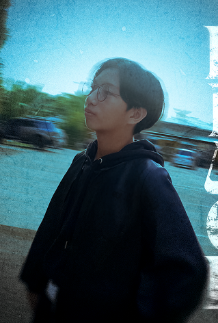 | 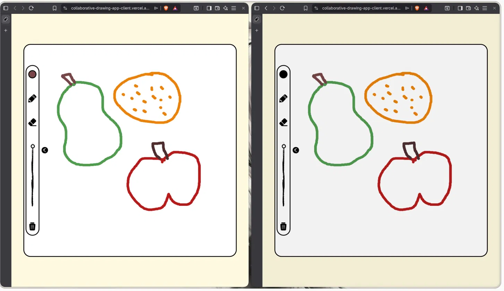 |

---

## Proof of Work

### Cannot be generated

Same with the previous images, these cannot be generated as it represents the actual view of my work. Moreover, the skill logos represent the actual logos such as Node.js, React, etc.

| Lead Case Screenshot (Draw Collab) | Secondary cases                       | Skill Logos                           |
| ---------------------------------- | ------------------------------------- | ------------------------------------- |
|           | 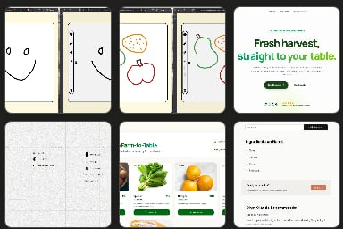 | 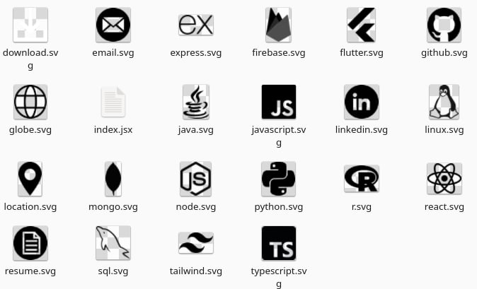 |

### Logos of all projects

I already had simple logos for my projects. But I wanted to try what Claude would give me. Here are some examples:

| Claude                                      | Original                                                    |
| ------------------------------------------- | ----------------------------------------------------------- |
| 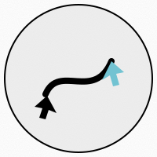   | 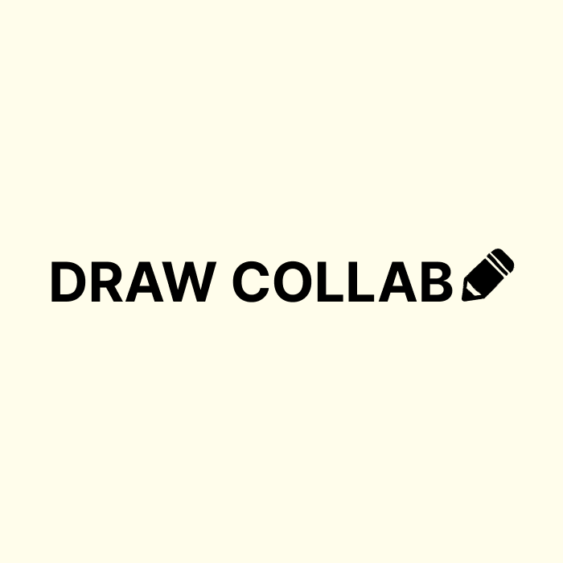        |
| 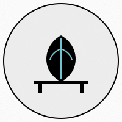 | 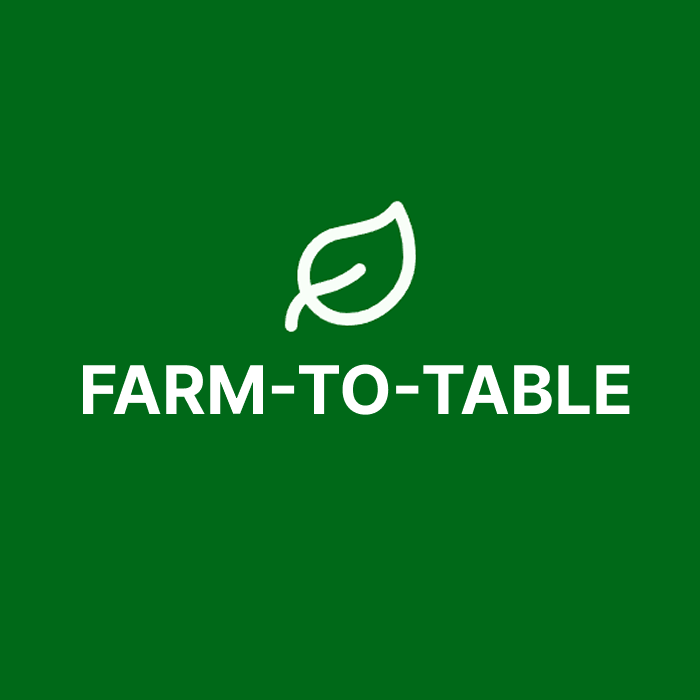 |
| 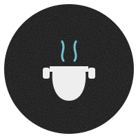       | 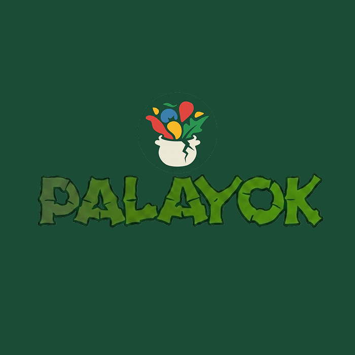     |

Yes, Claude followed my design philosophy for the icons. But I want the portfolio to follow that philosophy, not every project. I want every project to have their own quirks, hence, the variance in color.

---

## Contact

### Cannot be generated

These are univesal and origanization logos so I did not generate them.

| Resume                                           | Github                                           | LinkedIn                                           | Email                                           |
| ------------------------------------------------ | ------------------------------------------------ | -------------------------------------------------- | ----------------------------------------------- |
| 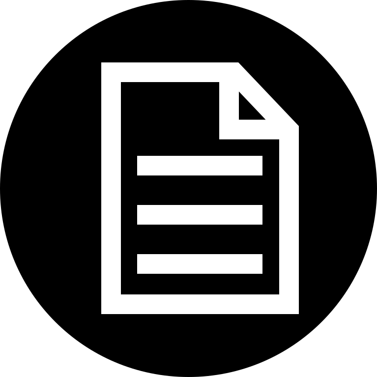 | 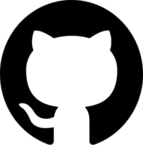 | 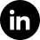 | 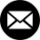 |

---

## About

Same hero photo reused

---

## Final Keepers

- **General**: Background (AI + Me), Icons(AI)
- **Hero**: My Photo (Real), Lead Case Snapshot (Real)
- **Proof of Work**: Lead Case Screenshot (Real), Secondary Cases (Real), Skill Logos (Real), Project Logos (Real)
- **Contact**: Resume icon (Real), Github icon (Real), LinkedIn icon (Real), Email icon (Real)
- **About**: My Photo (Real)
