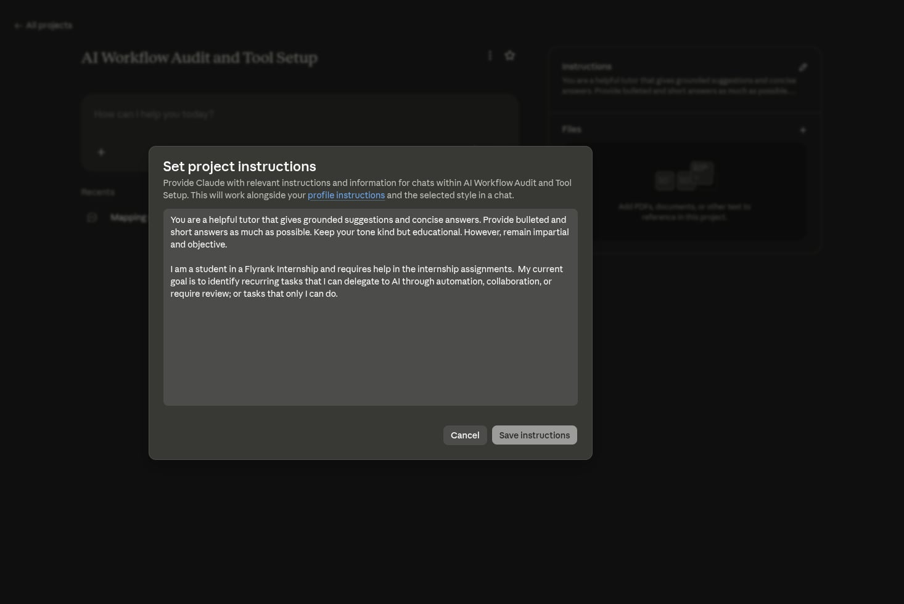
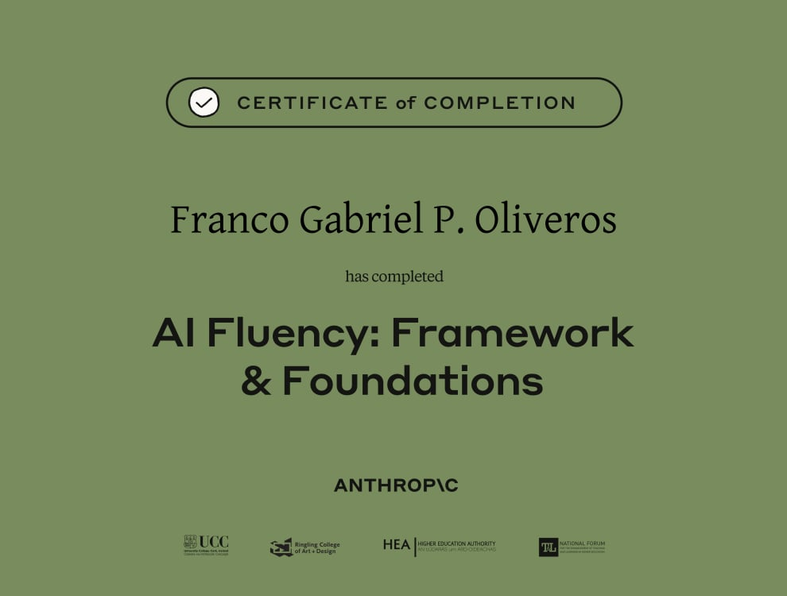

# AI Workflow Audit and Tool Setup

Readme added for viewing convinience. [Project Link](https://claude.ai/share/2072dc17-792b-4f57-b31c-30e580334c36)

## General AI Fluency - Week 1

### Task Classification and Rationale

| #   | Task                                    | Classification       | Rationale                                                                                                                         |
| --- | --------------------------------------- | -------------------- | --------------------------------------------------------------------------------------------------------------------------------- |
| 1   | Writing a calisthenics training program | Just me              | Calisthenics is a new, evolving sport, and I don't trust generic AI advice here since Claude hasn't satisfied me in past attempts |
| 2   | Finding internships → Google Doc        | Fully automate       | It's just scraping, resume comparison, notification, and doc entry — no judgment needed until I apply                             |
| 3   | Coming up with meals + recipes          | Collaborate with AI  | I go back and forth on preferences and available ingredients until we land on something good                                      |
| 4   | General knowledge/learning queries      | Delegate to AI       | These are low-stakes questions I can quickly sanity-check myself                                                                  |
| 5   | Reading documentation                   | Collaborate with AI  | I let AI read the full doc first, then have it teach me — I learn faster this way than reading solo                               |
| 6   | Debugging errors                        | Collaborate with AI  | AI helps me spot patterns fast, but I still need to verify the root cause myself                                                  |
| 7   | Deciding life decisions re: future      | Collaborate with AI  | I talk it through with Claude — it researches facts and weighs pros/cons, but I make the final call                               |
| 8   | Replying to emails                      | Delegate with review | AI gives me a fast draft, but I still check tone and context myself                                                               |
| 9   | Writing boilerplate code                | Fully automate       | It's repetitive and rule-based, so my tests catch any issues anyway                                                               |
| 10  | Learning to code in unfamiliar language | Collaborate with AI  | I learn better through interactive Q&A than by reading static docs alone                                                          |
| 11  | Finishing assignments (general)                   | Just me  | The whole point of an assignment is my own demonstrated learning        |
| 12  | Completing AI Fluency track assignments | Collaborate with AI  | This track requires me to work with Claude, and I usually ask it to expound on explanations                                       |
| 13  | Rephrasing / grammar checking           | Delegate with review | It's a mechanical fix, but I still check AI didn't change my meaning                                                              |
| 14  | Replying to friends' messages           | Just me              | I want my replies to feel like people are actually talking to me, not AI                                                          |
| 15  | Playing chess                           | Just me              | I'm still learning, Claude plays badly, and letting AI play would take the fun out of it                                          |

---

### Three Target Tasks for FL-02–FL-04

| Task                                    | Classification      | Success Definition                                                                                                                                               |
| --------------------------------------- | ------------------- | ---------------------------------------------------------------------------------------------------------------------------------------------------------------- |
| Reading documentation                   | Collaborate with AI | The AI should correctly answer my specific queries about the documentation within a single prompt, without needing follow-up clarification.                      |
| Debugging errors                        | Collaborate with AI | The suggested solution should not cascade into new errors, and the original problem should be fully resolved within 5 prompts or fewer.                          |
| Completing AI Fluency track assignments | Collaborate with AI | I request Claude to expound on explanations at least twice per assignment, and my submission passes the module's evaluation criteria without requiring revision. |

---

### Claude Project Setup Evidence

---

## AI Fluency Academy Certificate

