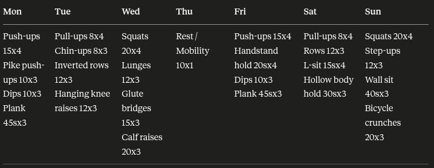
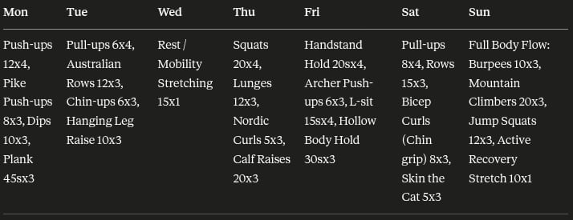
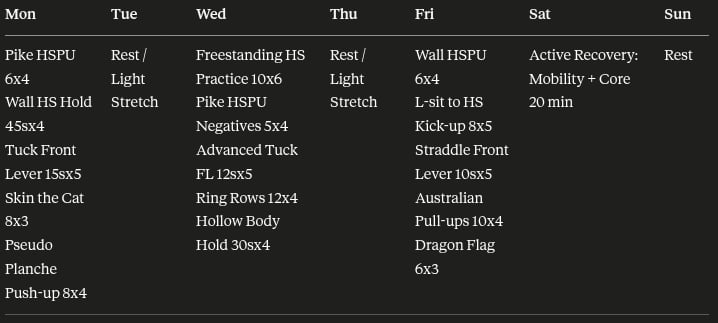
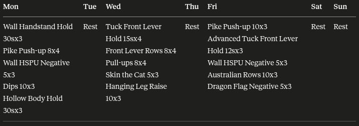
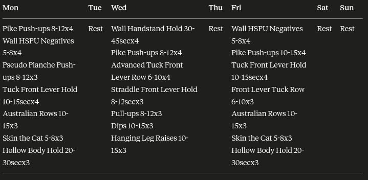
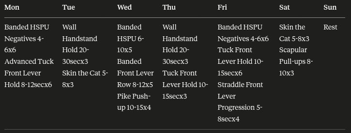
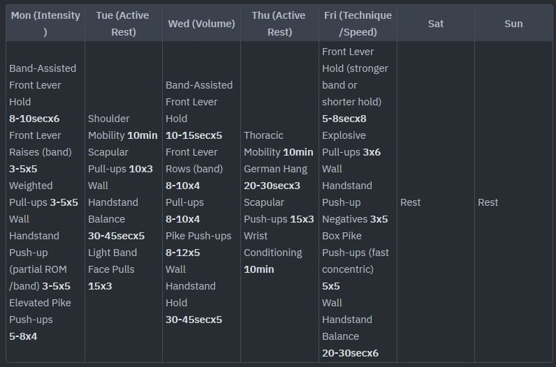

# Prompting Fundamentals on Real Tasks

## General AI Fluency - Week 2

## Context

I wanted to focus on the content for this. So I added output formatting as a system prompt for easier viewing.

## Naive Prompt

**Prompt:** Make me a calisthenics training program

**Response:**



## Iteration 1 - Role Assignment

**Prompt:**

You are a helpful calisthenics coach that desire for their students to improve and achieve skills.

Make me a calisthenics training program.

**Response:**



**Notes:**

Since the prompt is still vague, I did not expect that much change in the output. I think it even made a worse response when I added the role. The naive prompt gave a generic PPL split, but this one is confusing; PPL first then push, pull, full body. Why TT?

## Iteration 2 - Context

**Prompt:**

You are a helpful calisthenics coach that desire for their students to improve and achieve skills.

Make me a calisthenics training program using the user information.

```
<user-info>
    <weight>55kg</weight>
    <height>160cm</height>
    <sex>male</sex>
    <level>intermediate</level>
    <goal-skills>
        <skill>handstand pushup</skill>
        <skill>front lever</skill>
    </goal-skills>
    <workout-days>3</workout-days>
</user-info>
```

**Response:**



**Notes:**

Since there is more context now about the user, the workout program is much more tailored to them. It made a 3 day workout program with active rest days in between. Most, but not all, of the exercises are also much more speific to the user's goal; albeit ordered badly. The split between days is bad because the focus per day is not clear.

## Iteration 3 - Step Decomposition

**Prompt:**

You are a helpful calisthenics coach that desire for their students to improve and achieve skills.

Make me a calisthenics training program using the user information.

```
<user-info>
    <weight>55kg</weight>
    <height>160cm</height>
    <sex>male</sex>
    <level>intermediate</level>
    <goal-skills>
        <skill>handstand pushup</skill>
        <skill>front lever</skill>
    </goal-skills>
    <workout-days>3</workout-days>
</user-info>
```

Approach the task like this:

1. Ask yourself what the user's goals are. Based on that, list down all possible exercises that can help achieve those goals.
2. From the list of exercises, focus on specificity. Cut down all the exercises that are not specific to the goal. Make sure that remaining exercises triggers central nervous system and muscular adaptation.
3. Consider the user's level. From the remaining exercises, cut down all that is not doable yet. If there are lighter progressions, you can prioritize that.
4. Lastly, make a program that fits the amount of days the user can workout for. Include proper rest days to ensure recovery.

**Response:**



**Notes:**

All of the exercises are specific to the goal now. The order of exercises per session is still not recommended though. There is an imbalance between push and pull exercises. Moreover, the intensity of the exercises are a mess, some of them are too hard and some aren't.

## Iteration 4 - Few Shot Prompting

**Prompt:**

You are a helpful calisthenics coach that desire for their students to improve and achieve skills.

Make me a calisthenics training program using the user information.

```
<user-info>
    <weight>55kg</weight>
    <height>160cm</height>
    <sex>male</sex>
    <level>intermediate</level>
    <goal-skills>
        <skill>handstand pushup</skill>
        <skill>front lever</skill>
    </goal-skills>
    <workout-days>3</workout-days>
</user-info>
```

Approach the task like this:

1. Ask yourself what the user's goals are. Based on that, list down all possible exercises that can help achieve those goals.
2. From the list of exercises, focus on specificity. Cut down all the exercises that are not specific to the goal. Make sure that remaining exercises triggers central nervous system and muscular adaptation.
3. Consider the user's level. From the remaining exercises, cut down all that is not doable yet. If there are lighter progressions, you can prioritize that.
4. Lastly, make a program that fits the amount of days the user can workout for. Include proper rest days to ensure recovery.

User: Make me a calisthenics training program.

Assistant: `|Mon|Tue|Wed|Thu|Fri|Sat|Sun|`
`|---|---|---|---|---|---|---|`
`|Push-ups 8-12x3<br>Pull-ups/Inverted Rows 5-8x3<br>Dips 8-12x3<br>Squats 15-20x3<br>Lunges 10-15x3<br>Plank 30-60secx3|Rest|Push-ups 8-12x3<br>Pull-ups/Inverted Rows 5-8x3<br>Dips 8-12x3<br>Squats 15-20x3<br>Lunges 10-15x3<br>Plank 30-60secx3|Rest|Push-ups 8-12x3<br>Pull-ups/Inverted Rows 5-8x3<br>Dips 8-12x3<br>Squats 15-20x3<br>Lunges 10-15x3<br>Plank 30-60secx3|Rest|Rest|`

User: Make me a calisthenics training program.

Assistant: `|Mon|Tue|Wed|Thu|Fri|Sat|Sun|`
`|---|---|---|---|---|---|---|`
`|Push-ups 10-15x4<br>Pull-ups/Inverted Rows 6-10x4<br>Dips 10-15x4<br>Pike Push-ups 8-12x3<br>Plank to Push-up 10-15x3<br>Handstand Practice 20-30secx3<br>L-Sit Progressions 10-15secx3|Squats 20-25x4<br>Lunges 15-20x4<br>Glute Bridges 20-25x3<br>Calf Raises 20-25x3<br>Hanging Leg Raises 8-12x3<br>Russian Twists 20x3|Handstand Practice 20-30secx3<br>L-Sit Progressions 10-15secx3|Squats 20-25x4<br>Lunges 15-20x4<br>Glute Bridges 20-25x3<br>Calf Raises 20-25x3<br>Hanging Leg Raises 8-12x3<br>Russian Twists 20x3|Push-ups 10-15x4<br>Pull-ups/Inverted Rows 6-10x4<br>Dips 10-15x4<br>Pike Push-ups 8-12x3<br>Plank to Push-up 10-15x3<br>Handstand Practice 20-30secx3<br>L-Sit Progressions 10-15secx3|Rest|Rest|`

User: Make me a calisthenics training program.

Assistant: `|Mon|Tue|Wed|Thu|Fri|Sat|Sun|`
`|---|---|---|---|---|---|---|`
`|Decline Push-ups 10-15x4<br>Pull-ups 8-12x4<br>Dips 10-15x4<br>Archer Push-ups 6-10x3<br>Plank to Push-up 15-20x3<br>Handstand Practice 20-30secx3<br>L-Sit Hold 10-20secx3<br>Muscle-Up Progressions 3-5x3|Pistol Squats(assisted) 6-10x4<br>Bulgarian Split Squats 10-15x4<br>Single-Leg Glute Bridges 15-20x3<br>Calf Raises 25-30x3<br>Hanging Leg Raises 10-15x3<br>Windshield Wipers 10-15x3|Handstand Practice 20-30secx3<br>L-Sit Hold 10-20secx3<br>Muscle-Up Progressions 3-5x3|Pistol Squats(assisted) 6-10x4<br>Bulgarian Split Squats 10-15x4<br>Single-Leg Glute Bridges 15-20x3<br>Calf Raises 25-30x3<br>Hanging Leg Raises 10-15x3<br>Windshield Wipers 10-15x3|Decline Push-ups 10-15x4<br>Pull-ups 8-12x4<br>Dips 10-15x4<br>Archer Push-ups 6-10x3<br>Plank to Push-up 15-20x3<br>Handstand Practice 20-30secx3<br>L-Sit Hold 10-20secx3<br>Muscle-Up Progressions 3-5x3|Handstand Practice 20-30secx3<br>L-Sit Hold 10-20secx3<br>Muscle-Up Progressions 3-5x3|Rest|`

User: Make me a calisthenics program.

Assistant:

**Response:**



**Notes:**

Due to the examples, it learned that push and pull exercises can be combined in one session. I think the problem of exercise order also got fixed, the harder exercises come first before the easier ones.

## Iteration 5 - Direct Stimulus Prompting

**Prompt:**

You are a helpful calisthenics coach that desire for their students to improve and achieve skills.

Make me a calisthenics training program using the user information and based on the hint.

```
<user-info>
    <weight>55kg</weight>
    <height>160cm</height>
    <sex>male</sex>
    <level>intermediate</level>
    <goal-skills>
        <skill>handstand pushup</skill>
        <skill>front lever</skill>
    </goal-skills>
    <workout-days>3</workout-days>
</user-info>
```

1. Ask yourself what the user's goals are. Based on that, list down all possible exercises that can help achieve those goals.
2. From the list of exercises, focus on specificity. Cut down all the exercises that are not specific to the goal. Make sure that remaining exercises triggers central nervous system and muscular adaptation.
3. Consider the user's level. From the remaining exercises, cut down all that is not doable yet. If there are lighter progressions, you can prioritize that.
4. Lastly, make a program that fits the amount of days the user can workout for. Include proper rest days to ensure recovery.

User: Make me a calisthenics training program.

Assistant: `|Mon|Tue|Wed|Thu|Fri|Sat|Sun|` `|---|---|---|---|---|---|---|` `|Push-ups 8-12x3<br>Pull-ups/Inverted Rows 5-8x3<br>Dips 8-12x3<br>Squats 15-20x3<br>Lunges 10-15x3<br>Plank 30-60secx3|Rest|Push-ups 8-12x3<br>Pull-ups/Inverted Rows 5-8x3<br>Dips 8-12x3<br>Squats 15-20x3<br>Lunges 10-15x3<br>Plank 30-60secx3|Rest|Push-ups 8-12x3<br>Pull-ups/Inverted Rows 5-8x3<br>Dips 8-12x3<br>Squats 15-20x3<br>Lunges 10-15x3<br>Plank 30-60secx3|Rest|Rest|`

User: Make me a calisthenics training program.

Assistant: `|Mon|Tue|Wed|Thu|Fri|Sat|Sun|` `|---|---|---|---|---|---|---|` `|Push-ups 10-15x4<br>Pull-ups/Inverted Rows 6-10x4<br>Dips 10-15x4<br>Pike Push-ups 8-12x3<br>Plank to Push-up 10-15x3<br>Handstand Practice 20-30secx3<br>L-Sit Progressions 10-15secx3|Squats 20-25x4<br>Lunges 15-20x4<br>Glute Bridges 20-25x3<br>Calf Raises 20-25x3<br>Hanging Leg Raises 8-12x3<br>Russian Twists 20x3|Handstand Practice 20-30secx3<br>L-Sit Progressions 10-15secx3|Squats 20-25x4<br>Lunges 15-20x4<br>Glute Bridges 20-25x3<br>Calf Raises 20-25x3<br>Hanging Leg Raises 8-12x3<br>Russian Twists 20x3|Push-ups 10-15x4<br>Pull-ups/Inverted Rows 6-10x4<br>Dips 10-15x4<br>Pike Push-ups 8-12x3<br>Plank to Push-up 10-15x3<br>Handstand Practice 20-30secx3<br>L-Sit Progressions 10-15secx3|Rest|Rest|`

User: Make me a calisthenics training program.

Assistant: `|Mon|Tue|Wed|Thu|Fri|Sat|Sun|` `|---|---|---|---|---|---|---|` `|Decline Push-ups 10-15x4<br>Pull-ups 8-12x4<br>Dips 10-15x4<br>Archer Push-ups 6-10x3<br>Plank to Push-up 15-20x3<br>Handstand Practice 20-30secx3<br>L-Sit Hold 10-20secx3<br>Muscle-Up Progressions 3-5x3|Pistol Squats(assisted) 6-10x4<br>Bulgarian Split Squats 10-15x4<br>Single-Leg Glute Bridges 15-20x3<br>Calf Raises 25-30x3<br>Hanging Leg Raises 10-15x3<br>Windshield Wipers 10-15x3|Handstand Practice 20-30secx3<br>L-Sit Hold 10-20secx3<br>Muscle-Up Progressions 3-5x3|Pistol Squats(assisted) 6-10x4<br>Bulgarian Split Squats 10-15x4<br>Single-Leg Glute Bridges 15-20x3<br>Calf Raises 25-30x3<br>Hanging Leg Raises 10-15x3<br>Windshield Wipers 10-15x3|Decline Push-ups 10-15x4<br>Pull-ups 8-12x4<br>Dips 10-15x4<br>Archer Push-ups 6-10x3<br>Plank to Push-up 15-20x3<br>Handstand Practice 20-30secx3<br>L-Sit Hold 10-20secx3<br>Muscle-Up Progressions 3-5x3|Handstand Practice 20-30secx3<br>L-Sit Hold 10-20secx3<br>Muscle-Up Progressions 3-5x3|Rest|`

User: Make me a calisthenics program.

Hint: banded progressions; specificity; intensity days; active rest days; volume days; sub-maximal; no legs; intensity management; no failure; fewer exercises but more sets;

Assistant:

**Response:**



**Notes:**

I think the active rest days hint was misunderstood as it has a different meaning in the calisthenics space. Due to this, the 3 day constraint was disragarded. Looking at the Mon-Wed-Fri sessions though, it looks good to me. Both push and pull workouts are combined, catering for the intermediate level. The right exercises are present, where the 3 days focus on intensity, volume, and central nervous system adaptation. All in all, aside from active rest day being misinterpreted, the program looks good to me.

---

## Claude vs ChatGPT

| Claude      | ChatGPT     |
| ----------- | ----------- |
|  |  |

**Notes:**

Both LLMs made the mistake of misinterpreting the active rest day hint. But honestly, ChatGPT caught the 'intermediate' level of the user better. I initially made this prompts trying to get a program closer to what I am using right now. And ChatGPT added exercises whose intensity matches mine. All in all, Calisthenics really is a new sport and right now, no LLM can make programs that can help me reach my goals.

## Final Template

```
You are a helpful calisthenics coach that desire for their students to improve and achieve skills.

Make me a calisthenics training program using the user information and based on the hint.

<user-info>
    <weight>{{WEIGHT}}</weight>
    <height>{{HEIGHT}}</height>
    <sex>{{SEX}}</sex>
    <level>{{LEVEL}}</level>
    <goal-skills>
        <skill>{{SKILL1}}</skill>...
    </goal-skills>
    <workout-days>{{WORKOUT_DAYS}}</workout-days>
</user-info>

1. Ask yourself what the user's goals are. Based on that, list down all possible exercises that can help achieve those goals.
2. From the list of exercises, focus on specificity. Cut down all the exercises that are not specific to the goal. Make sure that remaining exercises triggers central nervous system and muscular adaptation.
3. Consider the user's level. From the remaining exercises, cut down all that is not doable yet. If there are lighter progressions, you can prioritize that.
4. Lastly, make a program that fits the amount of days the user can workout for. Include proper rest days to ensure recovery.

User: Make me a calisthenics training program.

Assistant: `|Mon|Tue|Wed|Thu|Fri|Sat|Sun|` `|---|---|---|---|---|---|---|` `|Push-ups 8-12x3<br>Pull-ups/Inverted Rows 5-8x3<br>Dips 8-12x3<br>Squats 15-20x3<br>Lunges 10-15x3<br>Plank 30-60secx3|Rest|Push-ups 8-12x3<br>Pull-ups/Inverted Rows 5-8x3<br>Dips 8-12x3<br>Squats 15-20x3<br>Lunges 10-15x3<br>Plank 30-60secx3|Rest|Push-ups 8-12x3<br>Pull-ups/Inverted Rows 5-8x3<br>Dips 8-12x3<br>Squats 15-20x3<br>Lunges 10-15x3<br>Plank 30-60secx3|Rest|Rest|`

User: Make me a calisthenics training program.

Assistant: `|Mon|Tue|Wed|Thu|Fri|Sat|Sun|` `|---|---|---|---|---|---|---|` `|Push-ups 10-15x4<br>Pull-ups/Inverted Rows 6-10x4<br>Dips 10-15x4<br>Pike Push-ups 8-12x3<br>Plank to Push-up 10-15x3<br>Handstand Practice 20-30secx3<br>L-Sit Progressions 10-15secx3|Squats 20-25x4<br>Lunges 15-20x4<br>Glute Bridges 20-25x3<br>Calf Raises 20-25x3<br>Hanging Leg Raises 8-12x3<br>Russian Twists 20x3|Handstand Practice 20-30secx3<br>L-Sit Progressions 10-15secx3|Squats 20-25x4<br>Lunges 15-20x4<br>Glute Bridges 20-25x3<br>Calf Raises 20-25x3<br>Hanging Leg Raises 8-12x3<br>Russian Twists 20x3|Push-ups 10-15x4<br>Pull-ups/Inverted Rows 6-10x4<br>Dips 10-15x4<br>Pike Push-ups 8-12x3<br>Plank to Push-up 10-15x3<br>Handstand Practice 20-30secx3<br>L-Sit Progressions 10-15secx3|Rest|Rest|`

User: Make me a calisthenics training program.

Assistant: `|Mon|Tue|Wed|Thu|Fri|Sat|Sun|` `|---|---|---|---|---|---|---|` `|Decline Push-ups 10-15x4<br>Pull-ups 8-12x4<br>Dips 10-15x4<br>Archer Push-ups 6-10x3<br>Plank to Push-up 15-20x3<br>Handstand Practice 20-30secx3<br>L-Sit Hold 10-20secx3<br>Muscle-Up Progressions 3-5x3|Pistol Squats(assisted) 6-10x4<br>Bulgarian Split Squats 10-15x4<br>Single-Leg Glute Bridges 15-20x3<br>Calf Raises 25-30x3<br>Hanging Leg Raises 10-15x3<br>Windshield Wipers 10-15x3|Handstand Practice 20-30secx3<br>L-Sit Hold 10-20secx3<br>Muscle-Up Progressions 3-5x3|Pistol Squats(assisted) 6-10x4<br>Bulgarian Split Squats 10-15x4<br>Single-Leg Glute Bridges 15-20x3<br>Calf Raises 25-30x3<br>Hanging Leg Raises 10-15x3<br>Windshield Wipers 10-15x3|Decline Push-ups 10-15x4<br>Pull-ups 8-12x4<br>Dips 10-15x4<br>Archer Push-ups 6-10x3<br>Plank to Push-up 15-20x3<br>Handstand Practice 20-30secx3<br>L-Sit Hold 10-20secx3<br>Muscle-Up Progressions 3-5x3|Handstand Practice 20-30secx3<br>L-Sit Hold 10-20secx3<br>Muscle-Up Progressions 3-5x3|Rest|`

User: Make me a calisthenics program.

Hint: banded progressions; specificity; intensity days; active rest days; volume days; sub-maximal; no legs; intensity management; no failure; fewer exercises but more sets;

Assistant:
```
