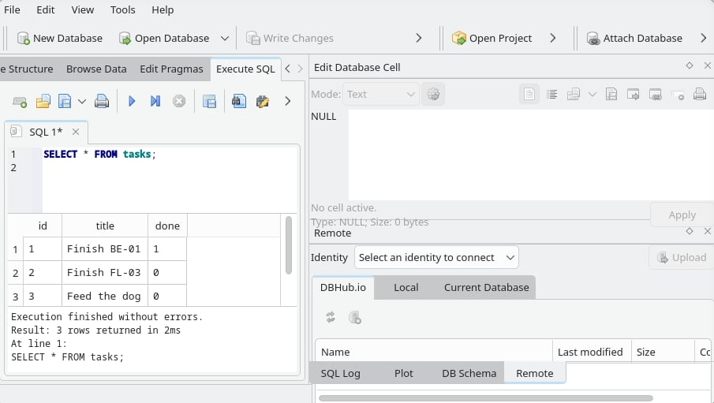
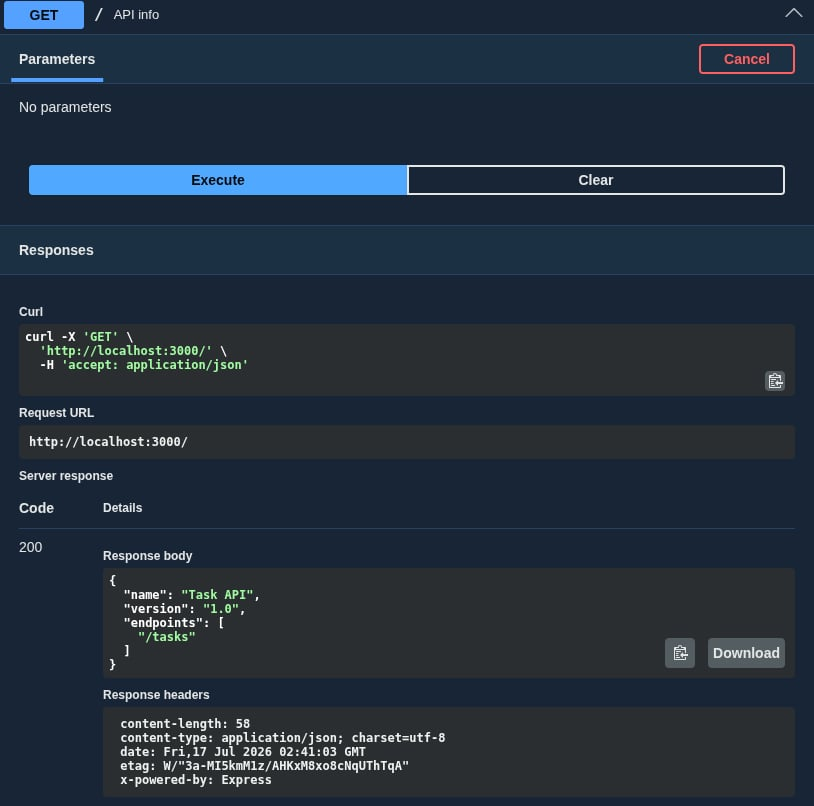
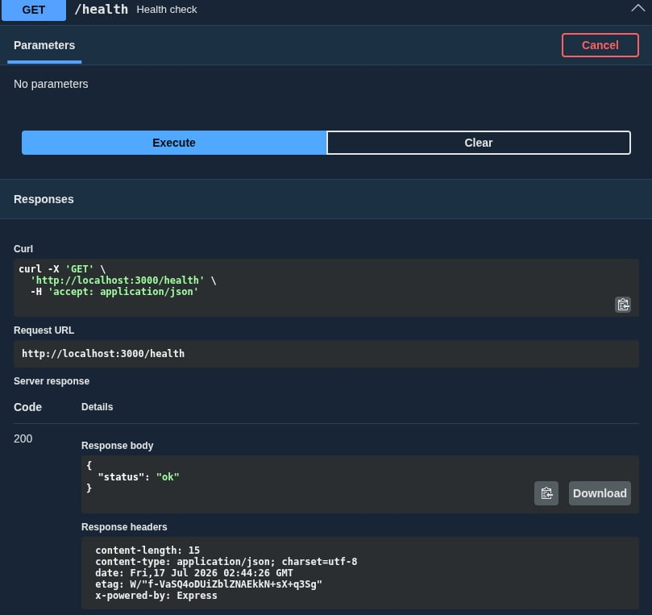
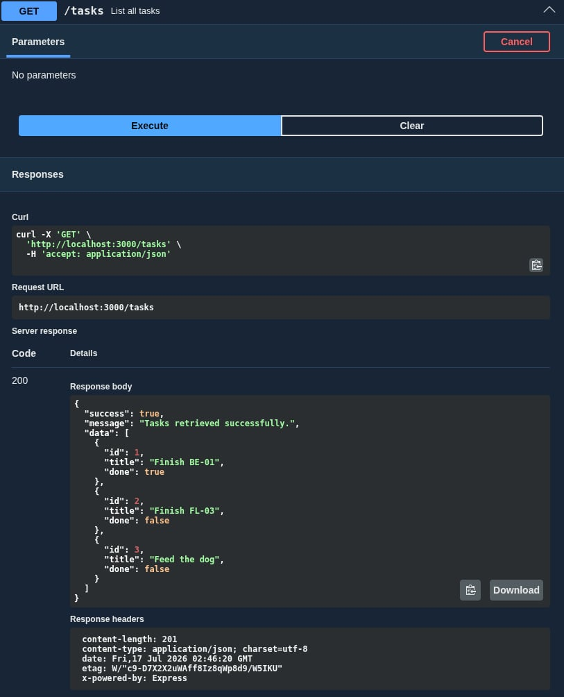
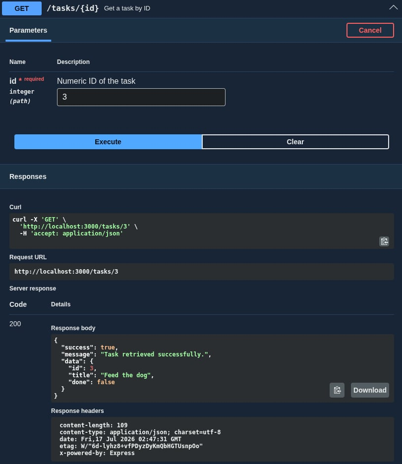
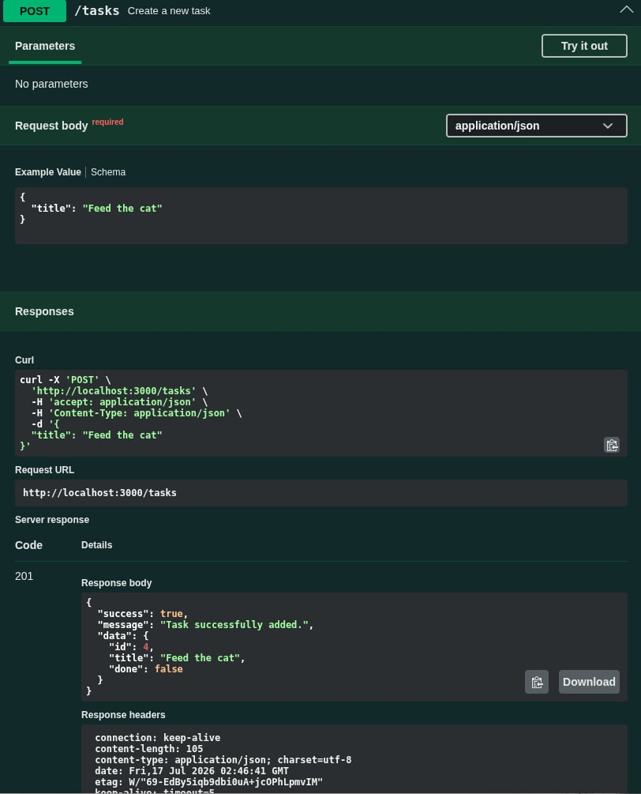
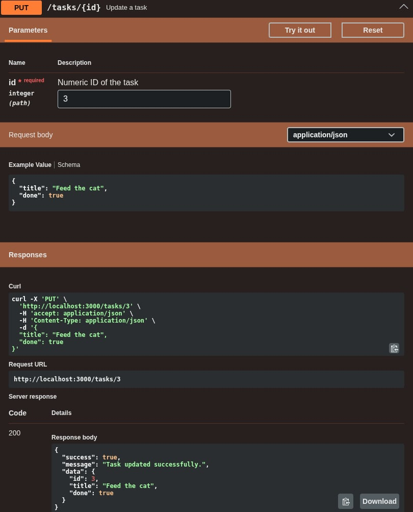
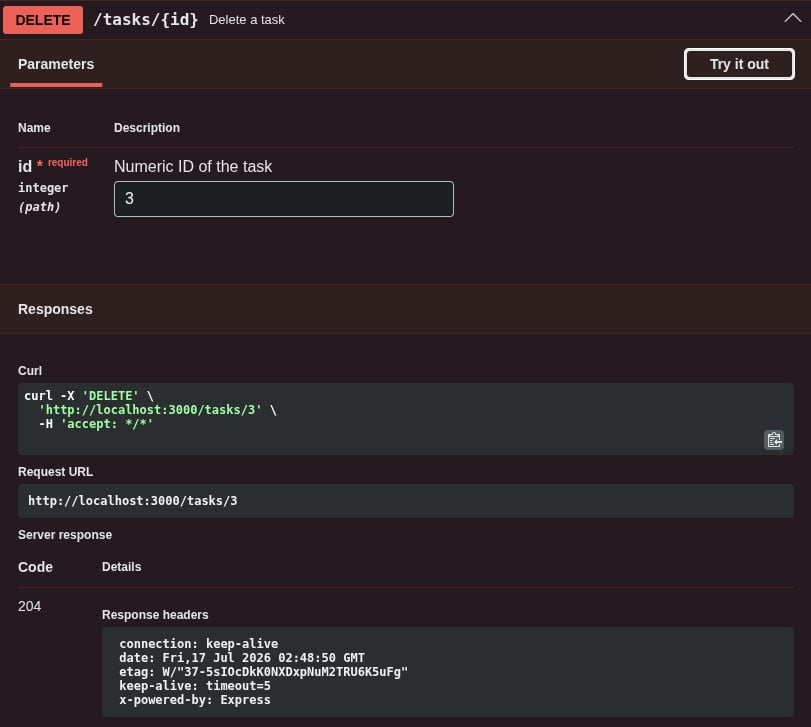

# Connecting to the Database

## Backend AI Engineering - Week 3

## Task API

A task management API that allows CRUD operations. It also comes with an interactive Swagger UI for exploring the API.

## Install & Run

Installation

```bash
git clone https://github.com/francogabrieloliveros/flyrank-internship.git
cd flyrank-internship
git checkout backend-ai-engineering/week3/connecting-to-the-database
```

Running

```bash
# Install dependencies and start server
npm install && npm run dev
```

The server starts on `http://localhost:3000`. Interactive docs are available at `http://localhost:3000/docs`.

## SQLite

SQLite was used as the database for this project as it allows for a very easy setup, data persistence, and same directory location for database items. **better-sqlite3** and **DB Browser for SQLite** were also one of the reasons why it was chosen. Upon setup, the database items will be stored in the `tasks.db` file.

```SQL
SELECT * FROM tasks;
```

You can try running this command through DB Browser for SQLite or better-sqlite3 to list all tasks that are currently in the data base.



## Endpoints

| Method | Path         | Description                | Body                                     | Success | Error(s) |
| ------ | ------------ | -------------------------- | ---------------------------------------- | ------- | -------- |
| GET    | `/`          | API info                   | —                                        | 200     | —        |
| GET    | `/health`    | Health check               | —                                        | 200     | —        |
| GET    | `/tasks`     | List all tasks             | —                                        | 200     | —        |
| GET    | `/tasks/:id` | Get a single task by ID    | —                                        | 200     | 404      |
| POST   | `/tasks`     | Create a new task          | `{ "title": string }`                    | 201     | 400      |
| PUT    | `/tasks/:id` | Update a task's title/done | `{ "title"?: string, "done"?: boolean }` | 200     | 400, 404 |
| DELETE | `/tasks/:id` | Delete a task              | —                                        | 204     | 404      |

## Example request

```

$ curl -i http://localhost:3000/tasks

HTTP/1.1 200 OK
X-Powered-By: Express
Content-Type: application/json; charset=utf-8
Content-Length: 201
ETag: W/"c9-D7X2X2uWAff8Iz8qWp8d9/W5IKU"
Date: Fri, 17 Jul 2026 03:06:31 GMT
Connection: keep-alive
Keep-Alive: timeout=5

{"success":true,"message":"Tasks retrieved successfully.","data":[{"id":1,"title":"Finish BE-01","done":true},{"id":2,"title":"Finish FL-03","done":false},{"id":3,"title":"Feed the dog","done":false}]}⏎

```

## Swagger UI Screenshots

Try out the API endpoints interactively [here](http://localhost:3000/docs) after running the server.

**/**



---

**/health**



---

**/tasks**



---

**/tasks/:id**



---

**/tasks**



---

**/tasks/:id**



---

**/tasks/:id**


